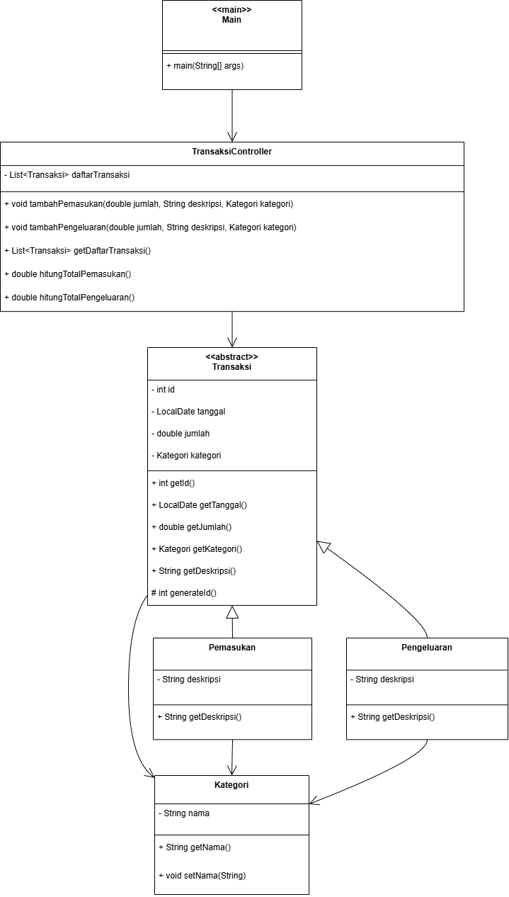

# 💰 DompetKu

Aplikasi manajemen keuangan sederhana berbasis Java dengan arsitektur **MVC (Model-View-Controller)**.  
DompetKu membantu pengguna mencatat pemasukan dan pengeluaran, serta menghitung total saldo saat ini.

## 📌 Deskripsi Proyek

DompetKu adalah aplikasi personal finance tracker yang mencatat dan mengelompokkan transaksi ke dalam kategori tertentu.
Aplikasi ini dibuat menggunakan bahasa pemrograman Java dengan pendekatan **MVC (Model-View-Controller)** sebagai bagian dari tugas besar mata kuliah **Pemrograman Berorientasi Objek (PBO)** di Telkom University Purwokerto.

- Bahasa Pemrograman: Java
- IDE: NetBeans
- Arsitektur: MVC (Model - View - Controller)

## ✅ Fitur

- Menambahkan transaksi pemasukan
- Menambahkan transaksi pengeluaran
- Mengelompokkan transaksi berdasarkan kategori
- Menampilkan daftar transaksi
- Menghitung total pemasukan, pengeluaran, dan saldo akhir

---

## 🔧 Struktur Kelas

### ✅ Class Diagram

Berikut adalah class diagram yang menggambarkan seluruh entitas dan relasi dalam aplikasi:

---

## 🖥️ Tampilan Aplikasi

Tampilan program ketika dijalankan di console:

---

## 👥 Kolaborator
Project ini dikembangkan oleh kelompok kami:
- Olivia Intan Puspita - 2311110006
- Afifah Faiqatzzahra - 2311110043
- Yasmine Alifta - 2311110044

---

